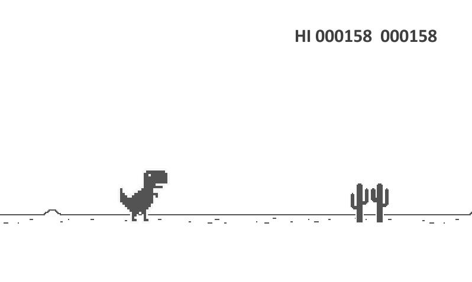

# my_runner_2017
First year project in C + SFML Library. The goal of this project is to create an endless running game. The player is a character who runs in a map given in parameter, enemies and obstacles can appear. So the player must avoid any ennemies and obstacles by using space bar to jump. As the player runs a score on the upper right corner will display and increase. The player must go as far as possible in order to gain the highest score.

PREREQUISITE : SFML must be installed.

USING : 1) Make 2) ./my_runner map.txt.

KEYS MAPPING : SPACE to jump.

